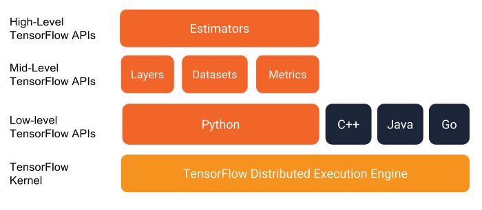

# Tensorflow without Keras

This tutorial helps you understand how to use tensorflow low-level or mid-level API to complete the work.



## Requirements
- python3.7
- tensorflow 2.6.0
- others: refer [requirements.txt](requirements.txt)

## Usable cmd

Start jupyter

```shell
jupyter notebook --port=8086 --ip=127.0.0.1
```
